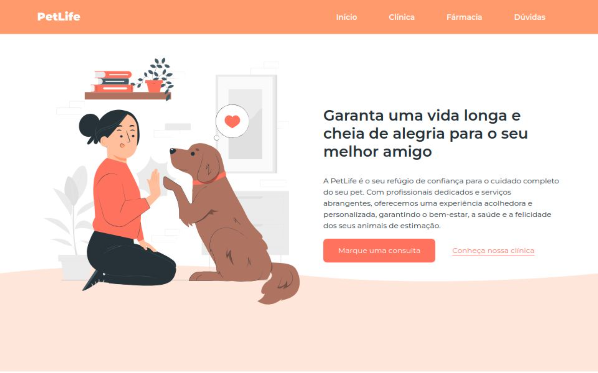

## Projeto: Website PetLife🐱

### Descrição Geral
Este projeto tem como objetivo criar um website para a clínica veterinária PetLife. O site foi desenvolvido utilizando HTML, CSS e JavaScript, com o intuito de fornecer informações claras e completas sobre os serviços oferecidos pela clínica, além de facilitar a interação com os clientes.

**⚠️Observação:**Este é um site fícticio.

### 📃Funcionalidades
* **Página inicial:** Apresenta um banner chamativo com informações sobre a clínica, um botão para agendar consultas e um call to action para conhecer a clínica.
* **Página da clínica:** Detalhes sobre os serviços oferecidos, como consultas, vacinação, cirurgias, etc.
* **Página da farmácia:** Informações sobre o petshop e a farmácia, com destaque para os produtos disponíveis.
* **Página de dúvidas frequentes:** Seção com perguntas e respostas sobre os serviços da clínica, com um efeito de expansão para visualizar as respostas completas.
* **Rodapé:** Contém informações de contato, links para as principais páginas e um rodapé com informações sobre o desenvolvimento do site.

### 💻Tecnologias Utilizadas
* **HTML:** Linguagem de marcação para estruturar o conteúdo do site.
* **CSS:** Linguagem de estilo para definir a aparência visual do site.
* **JavaScript:** Linguagem de programação para adicionar interatividade ao site.
* **Fontes:** Montserrat (Google Fonts) para garantir a consistência visual do site.

### 😃Instruções para Uso
1. **Clonagem do Repositório:** Clone este repositório para sua máquina local utilizando o Git.
2. **Servidor Local:** Utilize um servidor local como o Live Server do Visual Studio Code ou o XAMPP para visualizar o site.
3. **Personalização:** Para personalizar o site, edite os arquivos HTML, CSS e JavaScript.
4. **Site para Acesso:**[Petlife](https://petlife-mu.vercel.app/)

### 😉Melhorias Futuras
* **Formulário de contato:** Implementar um formulário de contato para que os clientes possam entrar em contato com a clínica diretamente pelo site.
* **Integração com redes sociais:** Integrar as redes sociais da clínica ao site para aumentar a visibilidade e interação com os clientes.
* **Otimização para SEO:** Otimizar o site para os mecanismos de busca, utilizando palavras-chave relevantes e meta tags.
* **Responsividade:** Melhorar a responsividade do site para garantir uma boa experiência em diferentes dispositivos (desktop, tablets e smartphones).

**⚠️Observações:**
* **Imagens:** As imagens utilizadas neste projeto são apenas para fins ilustrativos.
* **Acessibilidade:** É importante garantir que o site seja acessível a todos os usuários.

**Desenvolvedor:** @JeyVictorDev

**Tecnologias Utilizadas:** HTML, CSS, JavaScript

